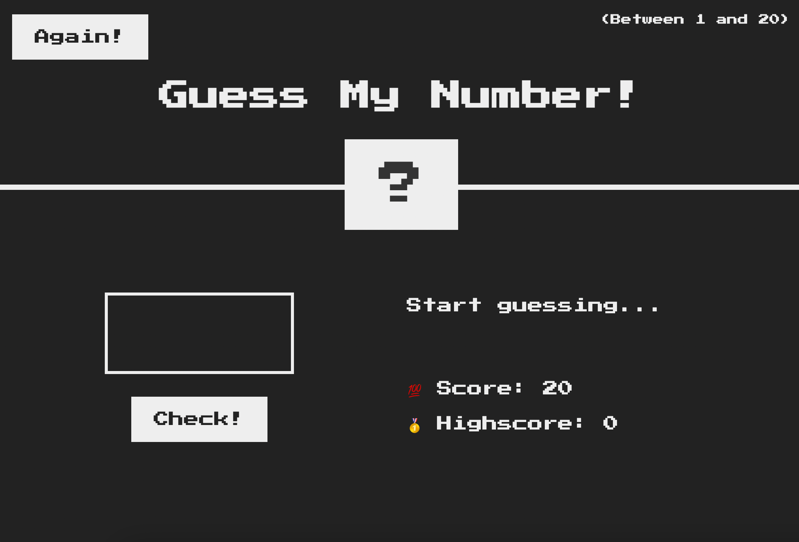
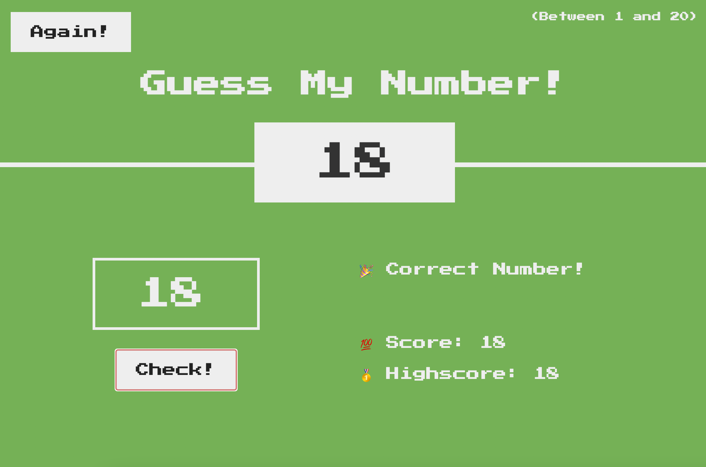

# Guess-the-Number-Game

🔢 A basic game to guess a secret number between 1 and 20.

🧑🏻‍💻 User enters a number and tries to guess the secret number using the leading messages displayed on the screen, like 'Too low' or 'Too high'. 

🎮 The game also keeps the record of user's score and saves the highest score. 

Here is a photo from the game:

Here is how it looks when you successfully guess the number:

